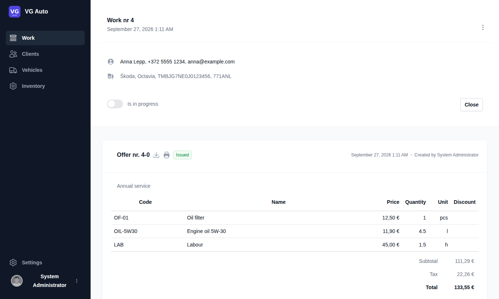

# VG Auto

English | [中文](README.md)

**VG Auto** is a self-hosted workshop management system for car repair shops: work orders, estimates, repair jobs, invoices, clients, vehicles and spare parts in one web interface.


## Features

- **Work orders** with several estimates and repair jobs; an accepted estimate becomes a repair job in one click
- **Estimates and invoices** as PDF, sent to the client by email; paid / overdue tracking
- **Clients and vehicles**: private and business clients, vehicle ownership history, full service history
- **Inventory**: spare parts with storage locations, prices and discounts, autocomplete in work orders
- **Email** through SMTP or Microsoft 365 (Microsoft Graph)
- **Sign in**: password + one-time code by email, password reset, Sign in with Microsoft,
  account lockout, forced password change for the initial administrator
- **Database**: PostgreSQL or MySQL 8, chosen in the configuration
- **No Docker needed**: Linux (systemd + pm2 + nginx), macOS and Windows

| Work details | Sign in |
|---|---|
|  |  |

## Quick install (Debian 12 / Ubuntu 22.04+)

```bash
git clone https://github.com/ecfranke/VG-Auto.git && cd VG-Auto
sudo deploy/prerequisites-debian.sh --db postgresql          # or --db mysql
sudo deploy/install.sh --app-url https://app.example.com --api-url https://api.example.com \
     --nginx --db-provider PostgreSql --admin-email you@example.com
# the first run writes /etc/vg-auto/*: create the database user, configure Email, then run again
sudo deploy/create-database.sh /etc/vg-auto/appsettings.Secrets.json
sudo deploy/install.sh
sudo certbot --nginx -d app.example.com -d api.example.com
```

First login: user `admin`, password in `/etc/vg-auto/initial-admin-password`. A code is sent to the admin email
and the password must be changed. Upgrade with `git pull && sudo deploy/install.sh`.

- **macOS**: `deploy/install.sh --app-url http://localhost:3000 --admin-email you@example.com` (API and web app under pm2)
- **Windows** (elevated PowerShell): `deploy\windows\install.ps1 -AdminEmail you@example.com`

The full guide (Chinese) is in [docs/deployment.zh-CN.md](docs/deployment.zh-CN.md): SMTP / Microsoft Graph,
the Microsoft sign-in app registration, databases, security settings and backups.

## Tech stack

| Part | Technology |
|---|---|
| Web app | Next.js 15, React 19, Tailwind CSS |
| API | ASP.NET Core (.NET 9), NHibernate + Dapper |
| Database | PostgreSQL 13+ or MySQL 8.0+ (DbUp migrations) |
| Email | MailKit (SMTP) or Microsoft Graph |
| PDF | Razor templates + Puppeteer (Chrome) |

## Development

```bash
scripts/setup-secrets.sh                           # development secrets
cd backend/src/DbUp && dotnet run                  # create the schema, prints the initial admin password once
cd ../VgAuto.Http.Api && dotnet run                # API on :15567 (Swagger at /swagger in Development)
cd ../../../frontend && npm ci && npm run dev      # web app on :3000
```

Tests: `cd backend/tests/VgAuto.Tests && dotnet test`. Set `VGAUTO_TEST_DB_HOST` (and `VGAUTO_TEST_DB_PROVIDER=MySql`
for MySQL) to include the database integration tests. GitHub Actions runs all tests on PostgreSQL and MySQL.

## License

VG Auto is released under the [GNU AGPL v3](LICENSE). It is based on [CarCare](https://github.com/rene98c/carcareco)
by rene98c; see [NOTICE](NOTICE). If you offer a modified version to users over a network, the AGPL requires you to
offer them its source code as well (the "Source code" link on the home page).
