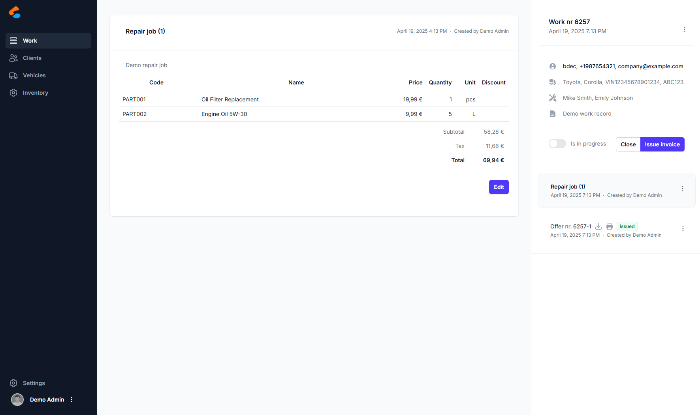

**VG-Auto** — a customized fork of [CarCare](https://github.com/rene98c/carcareco) (AGPL-3.0).

# CarCare

**CarCare** is a modern, self-hosted workshop management system built for vehicle service centers, auto repair shops, and maintenance facilities. It helps streamline your operations from job tracking to invoicing — all in one intuitive interface.



## ✨ Features

- 📋 Work order management with parts and labor tracking
- 🚗 Vehicle and client profiles with full history
- 📎 Offer and invoice generation with PDF export
- 🧰 Inventory and spare part control
- 📩 Email integration for quotes/invoices
- 🤪 CI/CD ready (Github Actions, Docker-based)
- 🌐 Clean modern UI (Next.js + Tailwind)

## What is different in this fork (VG-Auto)

- **No Docker needed**: install scripts for Linux (systemd + pm2 + nginx), macOS (pm2) and Windows (Windows service + pm2).
- **PostgreSQL or MySQL 8**, selected with `DbOptions:Provider`.
- **Email via SMTP or Microsoft Graph** (estimates, invoices, login codes).
- **Login**: password + emailed one-time code, password reset by email, Sign in with Microsoft.
- **Security hardening**: parameterized SQL, authenticated API by default, no default password,
  account lockout, restricted CORS, no error details in production. See the git history for details.

Full guide (Chinese): [docs/deployment.zh-CN.md](docs/deployment.zh-CN.md)

## 🚀 Install on Linux (Debian 12 / Ubuntu 22.04+)

```bash
git clone https://github.com/ecfranke/VG-Auto.git && cd VG-Auto
sudo deploy/prerequisites-debian.sh --db postgresql          # or --db mysql
sudo deploy/install.sh --app-url https://app.example.com --api-url https://api.example.com \
     --nginx --db-provider PostgreSql --admin-email you@example.com
# first run writes /etc/carcare/*: create the database user, configure Email, then:
sudo deploy/create-database.sh /etc/carcare/appsettings.Secrets.json
sudo deploy/install.sh
sudo certbot --nginx -d app.example.com -d api.example.com
```

First login: user `admin`, password in `/etc/carcare/initial-admin-password`; a code is sent to the admin email
and the password must be changed. Upgrade with `git pull && sudo deploy/install.sh`.

## macOS / Windows

- macOS: `deploy/install.sh --app-url http://localhost:3000 --admin-email you@example.com` (API and web under pm2).
- Windows (elevated PowerShell): `deploy\windows\install.ps1 -AdminEmail you@example.com`.

## Development

```bash
scripts/setup-secrets.sh                                     # dev secrets
cd backend/src/DbUp && dotnet run                            # create schema, prints the initial admin password once
cd ../Carmasters.Http.Api && dotnet run                      # API on :15567 (Swagger at /swagger in Development)
cd ../../../frontend && npm ci && npm run dev                # web on :3000
```

Tests: `cd backend/tests/Carmasters.Tests && dotnet test` (set `CARCARE_TEST_DB_HOST`, and
`CARCARE_TEST_DB_PROVIDER=MySql` for MySQL, to include the database integration tests).

## 🛠 Tech Stack

- **Frontend:** Next.js 15, Tailwind CSS, Headless UI
- **Backend:** ASP.NET Core (.NET 9), NHibernate + Dapper
- **Database:** PostgreSQL or MySQL 8
- **Email:** MailKit (SMTP) or Microsoft Graph

The Docker files from upstream (`docker-compose*.yml`, `*Dockerfile`) are not maintained in this fork.

## 📄 License

[GNU AGPL v3.0](LICENSE)

---

## 🤝 Contributing (coming soon)

Want to help? Contributions, ideas, and feedback welcome!  
I am working on a CONTRIBUTING.md and roadmap.

