<p align="center"></p>

<h1 align="center">VG Auto</h1>

<p align="center"><a href="README.en.md">English</a> | 中文</p>

VG Auto 是一套自托管的汽修厂管理系统。从接车开报价、客户确认、维修，到开发票、收款，全部在浏览器里完成。报价单和发票自动生成 PDF，并通过邮件发给客户。

本文分三部分：

1. [使用指南](#使用指南)：给前台和技师看，按日常流程一步步操作
2. [安装](#安装)：给负责部署的人看
3. [开发者文档](#开发者文档)：架构、配置、接口、数据库迁移和测试

---

## 使用指南

### 一个工单的完整流程

```
新建客户 → 登记车辆 → 新建工单（报价）→ 录入配件和工时 → 出具报价并发给客户
        → 客户接受，自动转成维修任务 → 维修完成，开发票 → 标记已收款
```

界面左侧是主菜单：**Home**（首页）、**Work**（工单）、**Clients**（客户）、**Vehicles**（车辆）、**Inventory**（配件库存）、**Settings**（设置）。登录后进入首页：上方是新建工单、客户、车辆的快捷按钮，下面是最近更新的 10 个工单（包括已完成的）。工单编号的格式为 `RP_TF_2019_HC_2026_09_28_15`：类型（RP 维修 / OF 只有报价）_ 车主姓名首字母 _ 车辆年份 _ 制造商和型号首字母 _ 开单日期 _ 原工单号，缺少的部分用 X；报价被接受、改车主或车辆后编号自动更新。报价单和发票用同样的方式命名：报价单是 `OF_TF_2019_HC_2026_09_28_15`（同一工单的第二份报价是 `…_15-1`），发票是 `RP_TF_2019_HC_2026_09_28_15`，和工单编号一致；单据的编号在出具时确定，以后不再变化，PDF 文件名和邮件标题里也是这个编号，系统里不再出现 “nr. 12” 这样的编号。在搜索框粘贴工单、报价单或发票的编号都可以直接找到工单。**Work** 列表的列为：工单号、类型（维修 / 报价）、状态、客户、车辆、技师、开始日期、备注。左下角是当前用户，点开可以进入个人资料或退出登录；旁边的按钮切换**浅色 / 深色 / 跟随系统**，界面是黑、白、蓝、灰的配色，打印和 PDF 始终是白底。

### 1. 登录

输入用户名和密码，点 **Sign in**。


系统会往你的邮箱发一个 6 位验证码。输入后点 **Verify**。没收到可以点 **Send a new code** 重新发送，验证码 10 分钟内有效。同一个浏览器输入过验证码后，**7 天内**再登录只需要用户名和密码；换浏览器、清除 Cookie 或修改密码后需要重新验证（天数由 `Authentication:EmailCode:RememberDeviceDays` 设置，0 表示每次都要验证码）。


- 忘记密码：在登录页点 **Forgot password?**，输入用户名或邮箱，用收到的验证码设置新密码。
- 如果管理员启用了 Microsoft 登录，登录页会出现 **Sign in with Microsoft** 按钮。第一次使用时需要先用邮箱验证码确认一次，之后可以直接用 Microsoft 账号登录。
- 连续输错密码会被暂时锁定，稍后再试即可。
- 初始管理员第一次登录时，系统会要求先修改密码。

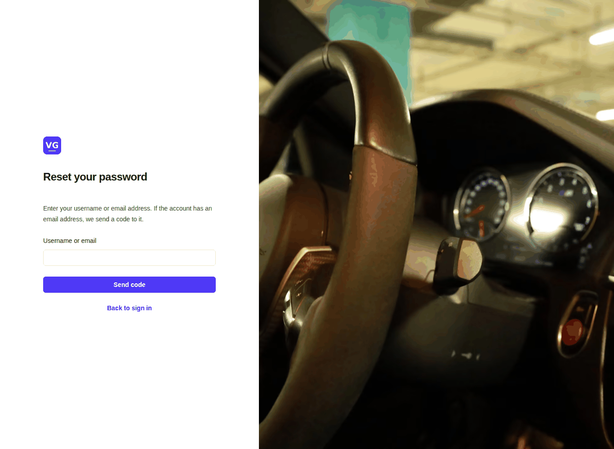

### 2. 新建客户

**Clients → Add new**。个人客户填写姓名、电话、邮箱；企业客户打开顶部的开关后填写公司名称和税号。邮箱很重要，报价单和发票都会发到这个地址。点 **Save** 保存。

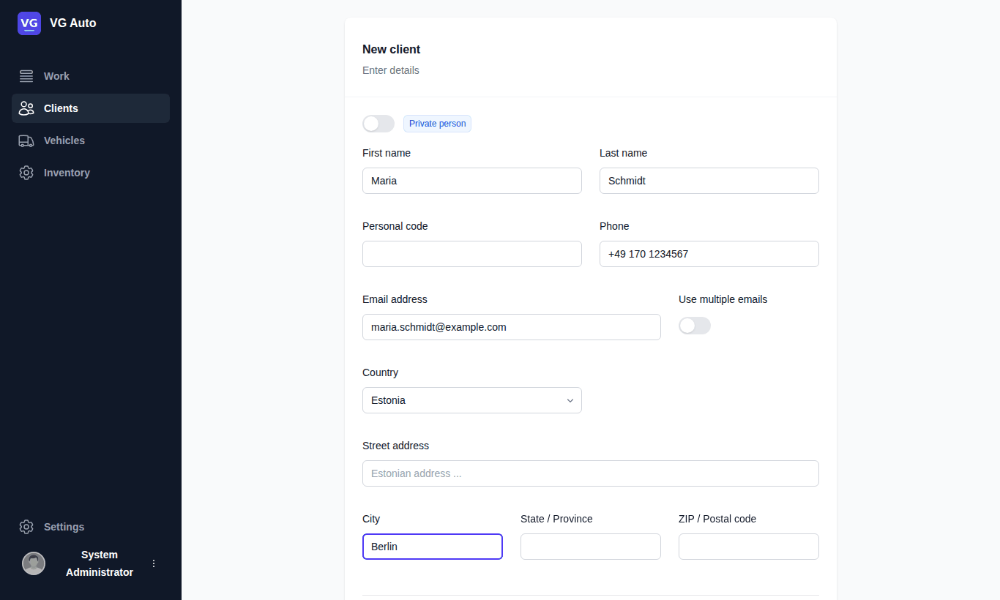

客户列表支持按姓名、电话、邮箱搜索，点客户名可以查看详情、车辆和历史工单。

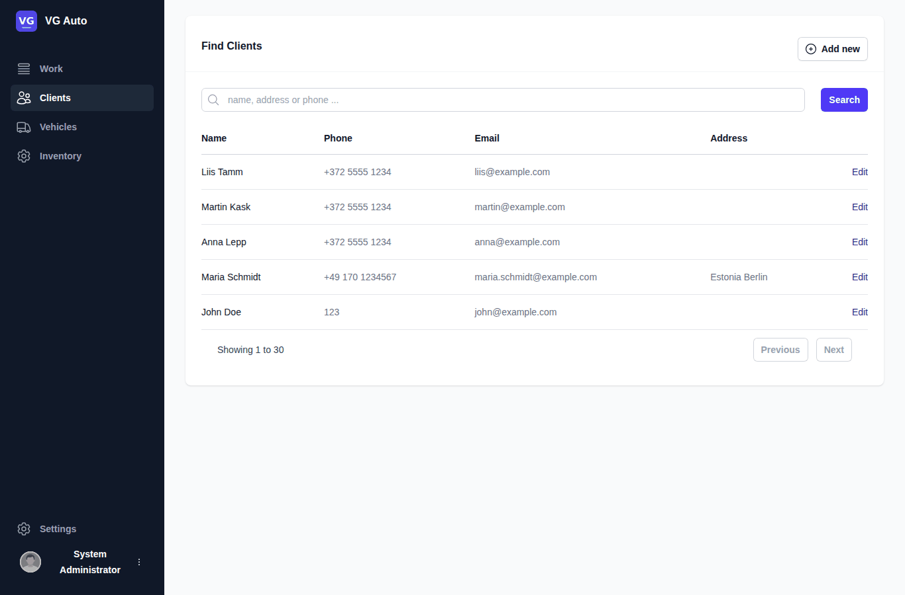

### 3. 登记车辆

**Vehicles → Add new**。先选**制造商**（Manufacturer），再从该制造商的**型号**（Model）列表里选择；列表里是目前在售和近年常见的车型，没有的制造商或型号可以直接输入（选 “Use …”）。再填写**配置**（Trim，如 LX、Touring，选填）、年份（Year，选填）、VIN、车牌号（License plate）和里程，在 **Owner** 里输入客户名并从下拉列表中选择车主。车辆显示为 “2019 Honda Civic LX”（年份 制造商 型号 配置），报价单和发票的编号下面也打印这一行。

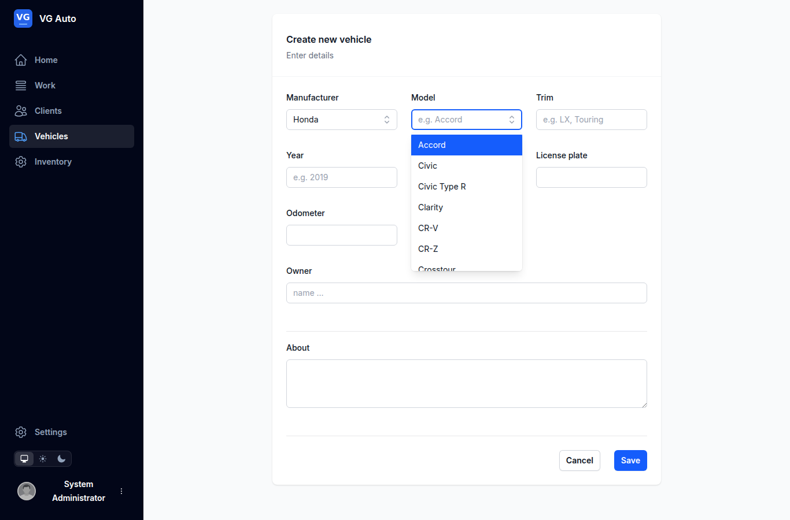

车辆换了车主时，改 Owner 即可，系统会保留归属变更记录。

管理员可以删除车辆：打开车辆，**Options → Delete**，确认后连同归属记录一起删除，并记入操作日志。已经用在工单里的车辆不能删除（会提示有几个工单在用）；普通用户看不到 Delete。

### 4. 新建工单

**Work → Add new**：

- **Start with**：打开 **Offer** 表示先给客户报价；关闭则直接开始维修任务（适合小修、不需要报价的情况）。
- **Client**：输入客户名选择。散客不想登记信息时，打开 **Undisclosed**。
- **Vehicle**：默认只列出该客户名下的车辆；打开 **Search all vehicles** 可以搜索所有车辆。右边的输入框填写本次进厂里程。
- **Mechanics**：选择负责的技师后点 **Add**；技师不在列表里时点 **New** 直接新建。
- **About**：填写客户描述的故障或本次保养内容。

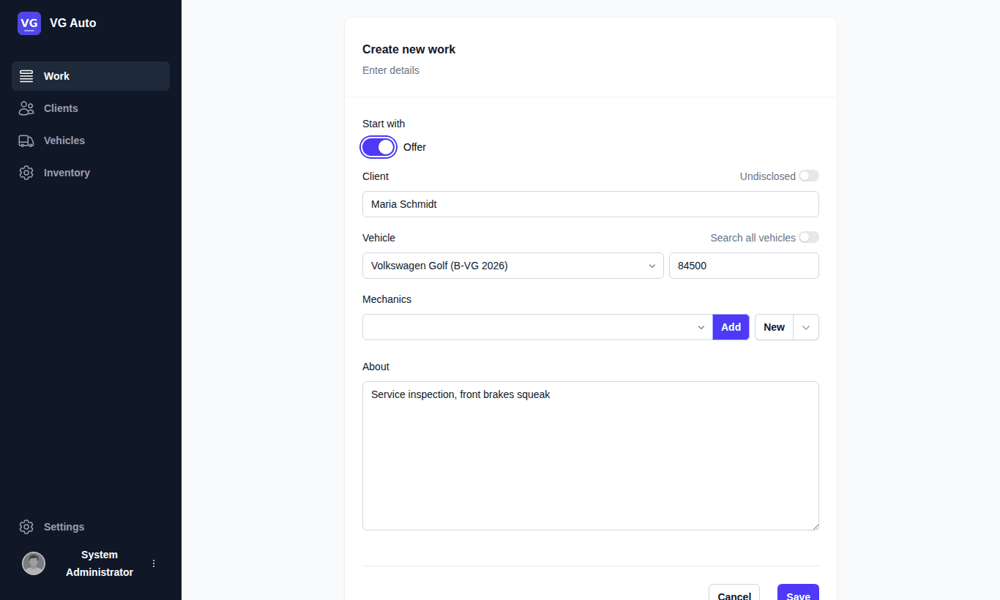

### 5. 录入配件和工时

保存工单后会直接进入报价的编辑界面。每一行是一项配件或工时：

- **Code**：输入配件编号或名称，下拉列表会显示库存里匹配的配件。选中后自动带出名称和价格。不填编号的行算作自定义项目，编号记为 `CUSTOM`。
- **Name / Price / Quantity / Unit / Discount**：名称、单价（**税前**）、数量、单位、折扣（%）。工时可以直接手填，比如 Code 填 `LAB`，单位填 `h`。
- **Add row** 添加一行；右侧的 ✕ 删除一行；拖动左侧的 ≡ 调整顺序。
- 右侧下拉菜单里的 **Apply discount** 可以给所有行统一打折。

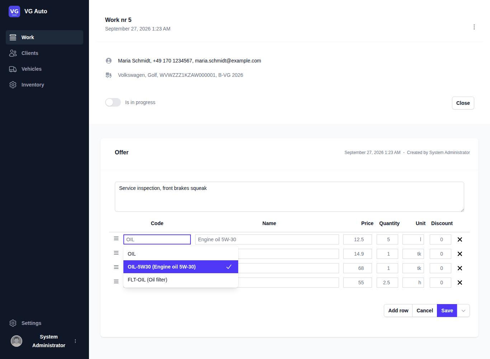

点 **Save** 保存。页面下方会显示税前小计、每一种税（如 GST、PST 分行显示）和总计；税在设置里配置（见第 12 节）。

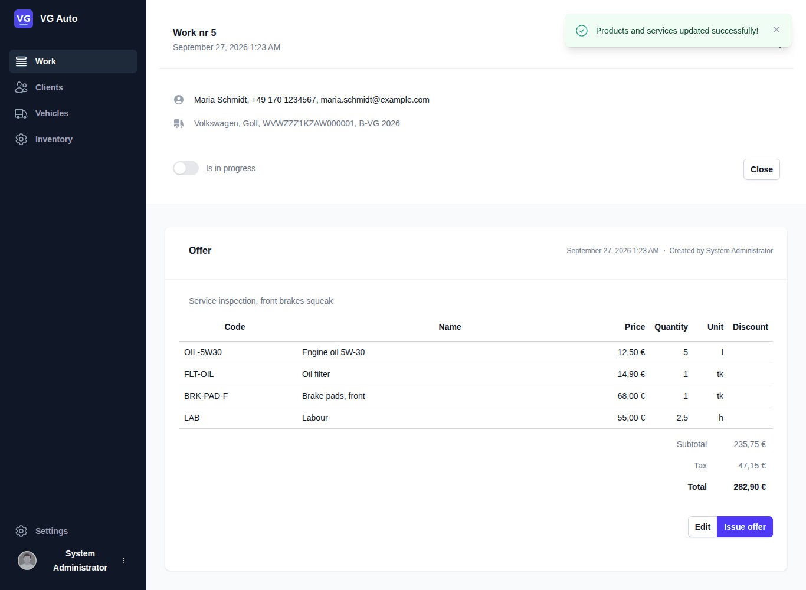

### 6. 出具报价并发给客户

点 **Issue offer**：

- **Show vehicle information on offer**：报价单上是否显示车辆信息。
- **Send client an email**：打开后会把报价单 PDF 直接发到下面填写的客户邮箱。

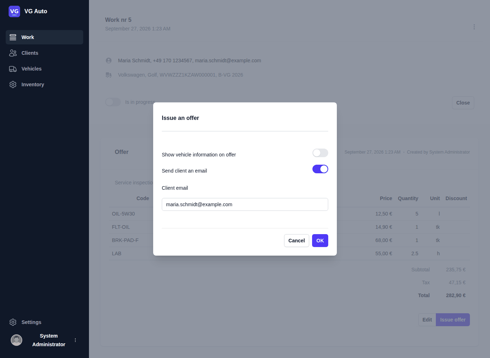

点 **OK** 后生成报价单编号（如 `OF_TF_2019_HC_2026_09_28_15`），标题旁出现 **Issued** 标记；邮件图标表示已发送。点下载或打印图标可以拿到 PDF。以后需要重发，在右下角的下拉菜单里选 **Resend offer**。报价单和发票右上角的编号下面会显示车辆，例如 “2019 Honda Civic LX”。已经发给客户的报价不能删除（需要修改时重新出具）；删除未发送的报价时，它的报价单也一并删除。

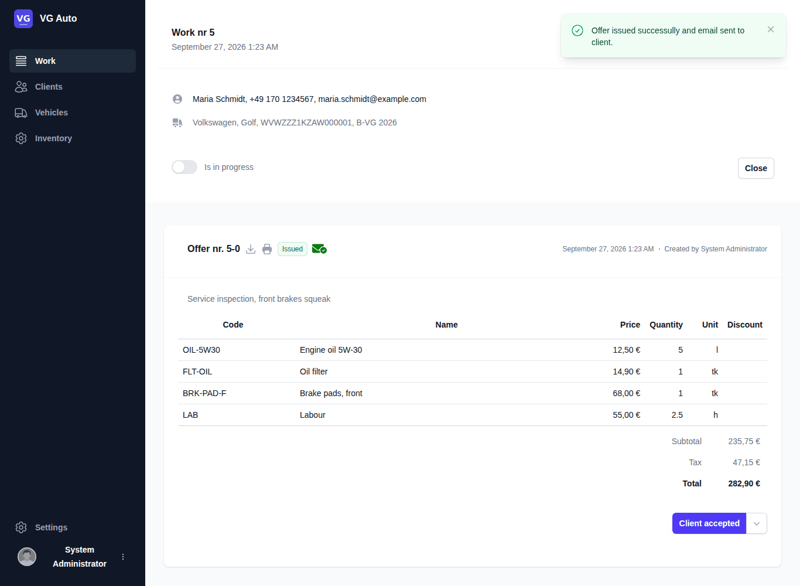

#### 客户在线确认并签名

发给客户的报价邮件里有一个 **Review and sign the estimate** 按钮（纯文本邮件里是链接），客户**不需要登录**，打开后可以查看报价单，填写姓名、在框里用鼠标或手指签名、勾选“已阅读并接受”，点 **Sign estimate**。签名后：

- 客户可以下载**带签名的报价单 PDF**；工单页面上该报价显示 **Signed** 标记（鼠标悬停显示签名人和时间），报价单的 PDF 和打印版也带上客户签名。
- 客户签名后由车间点 **Client accepted** 开始维修（签名不会自动转成维修任务）。
- 链接 30 天内有效（`Signing:LinkDays`），每份报价只能签一次；重新出具的报价是新的报价单，会发新的链接。
- 链接地址用的是 `App:Url`（系统的访问地址）；没有设置时使用 `Cors:AllowedOrigins` 里的第一个地址（安装脚本已经把 App URL 写在那里），再没有时使用网页服务器的地址（`APP_URL` 或浏览器访问的地址）。

| 客户打开链接 | 签名后 |
|---|---|
| 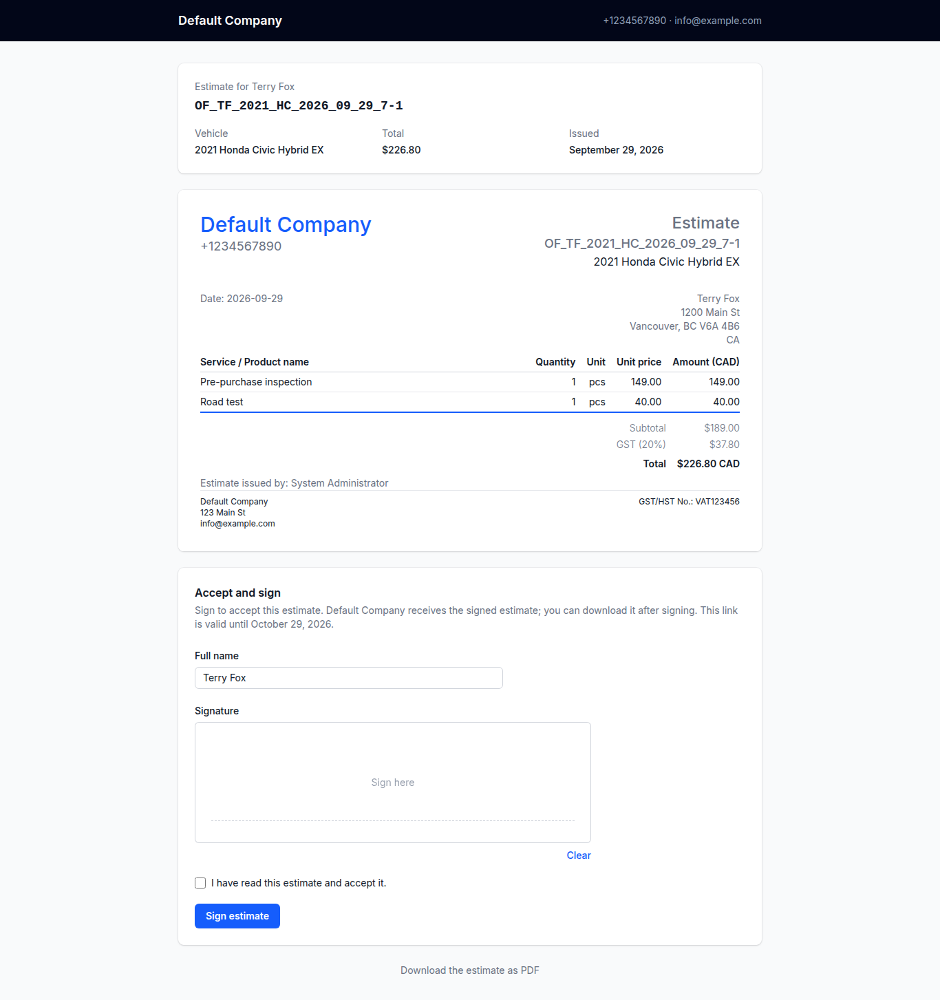 | 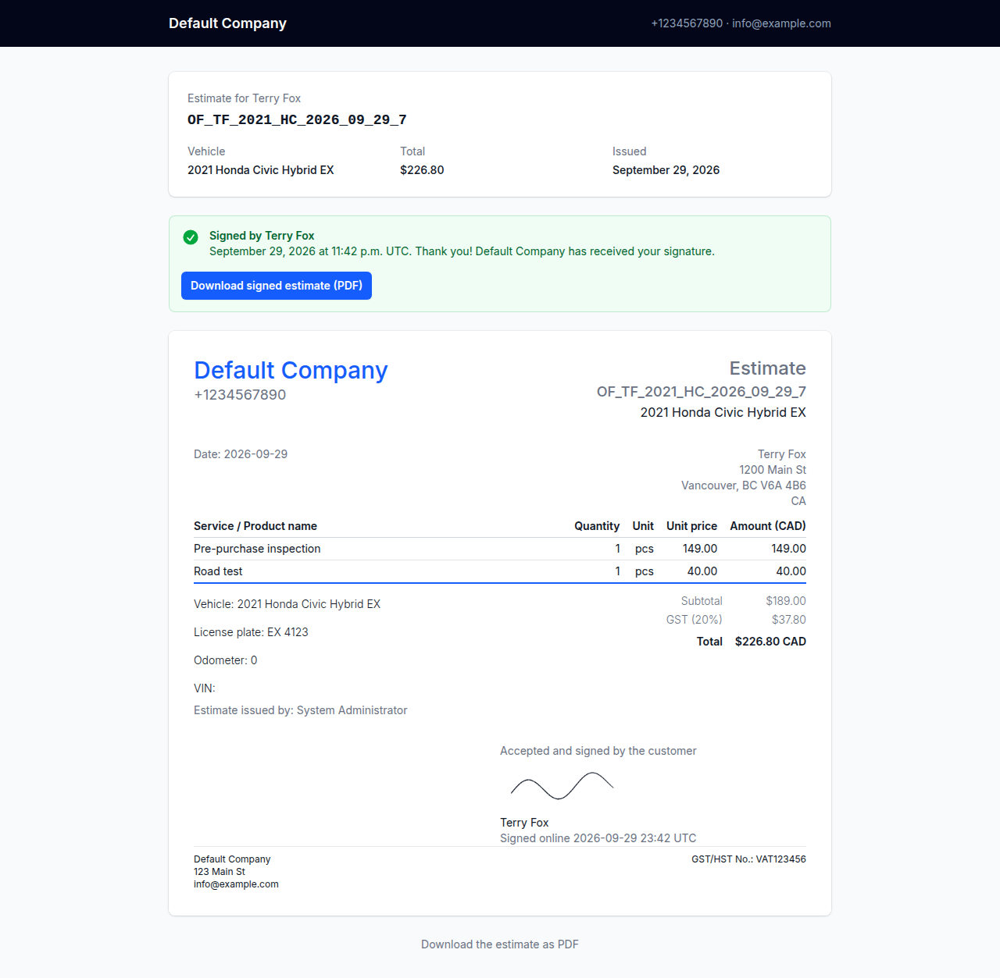 |

### 7. 客户接受报价，开始维修

客户确认后点 **Client accepted**，可以填写要带到维修任务里的备注，点 **OK**。

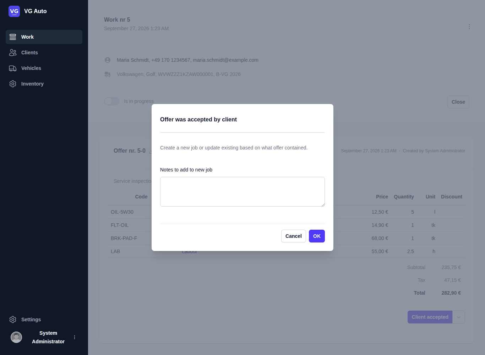

系统会自动新建一个 **维修任务（Repair job）**，报价里的所有项目都会复制过去。维修中如果多换了零件或多花了工时，直接在维修任务里修改并保存。

打开 **Is in progress** 表示车辆正在维修中，工单列表可以按这个状态筛选。

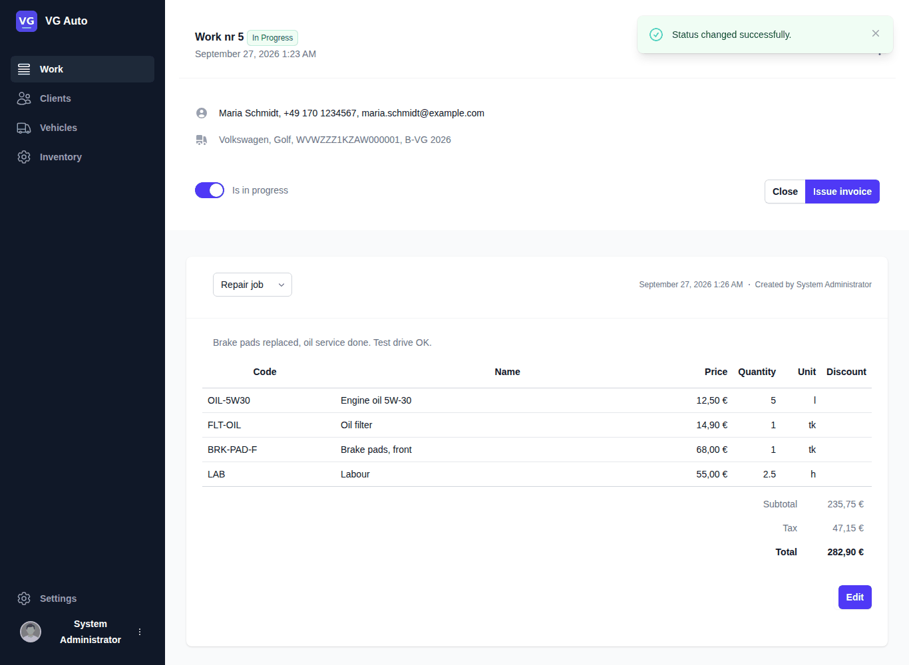

一张工单可以有多份报价和多个维修任务。工单右上角的 ⋮ 菜单里有 **Make an offer**（再做一份报价）、**Start repair job**、**Edit**、**Create a copy**、**Delete**。

### 8. 完工开票

点 **Issue invoice**：

- **Due days**：付款期限（天）
- **Payment type**：付款方式（现金、银行转账、刷卡）
- **Send client an email**：把发票 PDF 发到客户邮箱

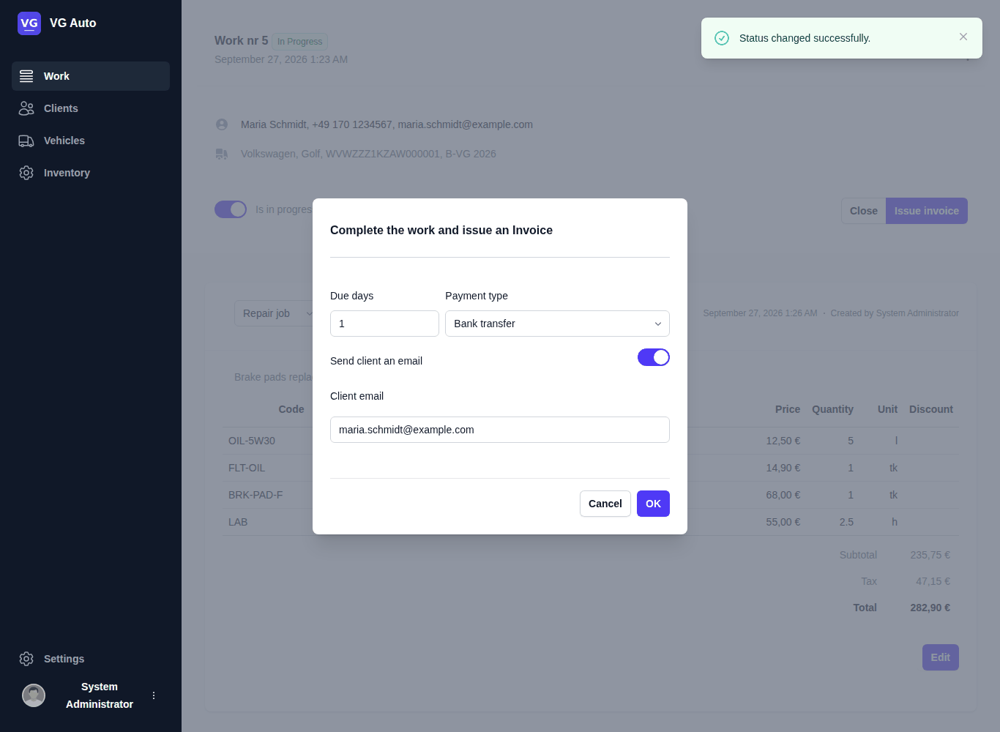

开票后工单状态变为 **Completed**，发票编号（和工单编号相同，如 `RP_TF_2019_HC_2026_09_28_15`）旁显示 **Unpaid**（未付款）。

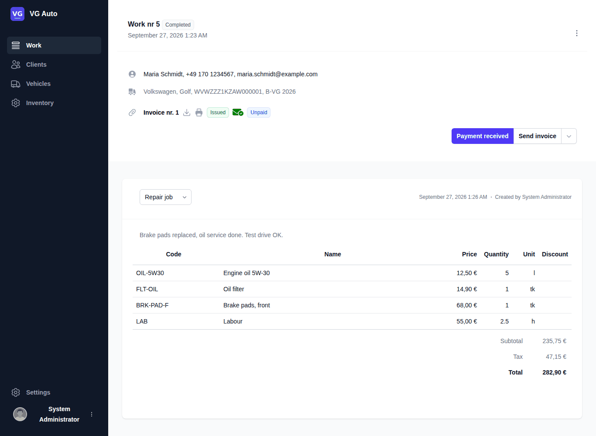

### 9. 登记收款

客户付款后点 **Payment received**，状态变为 **Paid**。点错了可以点 **Unpaid** 撤回。**Send invoice** 用来重新发送发票；右侧下拉菜单里的 **Delete invoice** 可以作废发票，工单会回到可编辑状态。

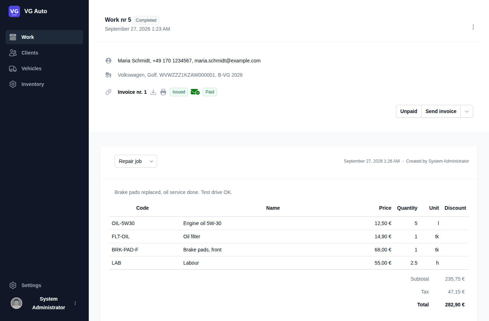

### 10. 查找工单

**Work** 页面：

- 默认只显示未完成的工单；打开 **Completed** 开关查看已开票的工单。
- 状态筛选：**All**、**In progress**、**Closed**，以及 **Invoice overdue**（已过期未付款）。
- 可以按工单号、客户、VIN、车牌、配件（**Product or service**）、日期范围搜索。
- 列表中的下载 / 打印图标直接获取报价单或发票的 PDF。

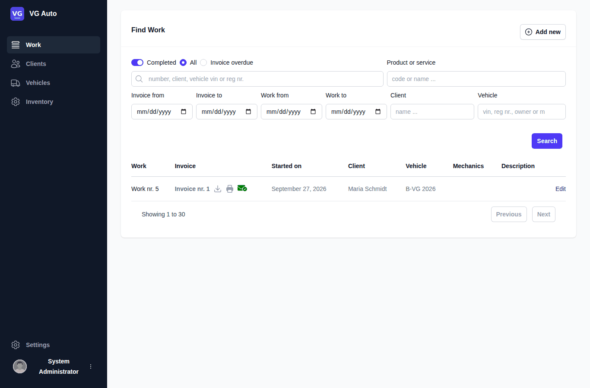

不需要开票就结束的工单（比如客户不修了），在工单页点 **Close** 关闭；需要时可以再点 **Open** 重新打开。

### 11. 配件库存

**Inventory → Add new**：填写配件编号、名称、税前价格、数量，在 **Location** 里选择库位（点 **New** 新建库位）。录入工单时，**Code** 列会从这里自动补全。

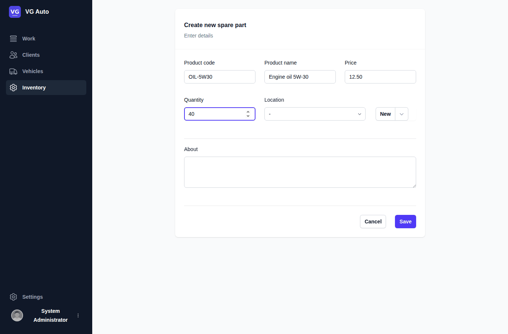

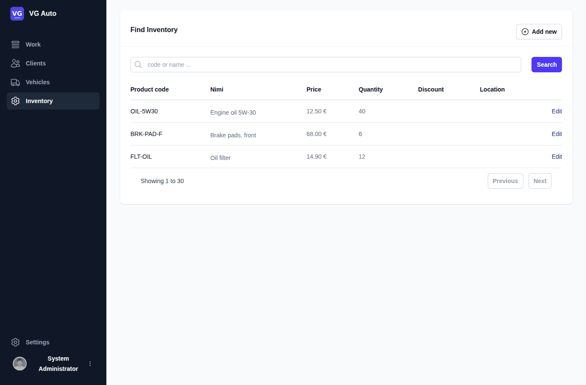

### 12. 设置

**Settings → Invoice Options** 里是公司信息（名称、地址、银行账户、Reg No、Tax ID，会打印在 PDF 上）、税、发票和报价单的邮件正文等。点右下角 **Edit** 修改：

- 所有人都可以修改电话、地址、邮箱、银行账户，以及发票设置（Invoice options）和报价单设置（Offer options）。
- **公司名称、Reg No、Tax ID 和币种**只能由管理员在后台的 **公司** 页面修改（见第 14 节），前台显示为灰色不可编辑。
- 这里改的是**自己所属公司**的设置；系统支持多个公司，每个公司的设置互不影响。

**税**（Taxes）：所有价格都按**税前**录入，开单时在小计上加税，报价单和发票上每一种税单独一行。
- **注册地**（国家 + 省/州）由管理员在后台设置。选择省份后自动填入当地的税：AB/NT/NU/YT 为 GST 5%，BC 为 GST 5% + PST 7%，MB 为 GST 5% + RST 7%，SK 为 GST 5% + PST 6%，QC 为 GST 5% + QST 9.975%，ON 为 HST 13%，NS 为 HST 14%，NB/NL/PE 为 HST 15%。美国和其他国家的税名和税率自己填。
- 税的名称和税率之后仍可修改（所有人都可以改，注册地只有管理员能改）。最多两种税。
- 注册在加拿大时，PDF 上的 Tax ID 显示为 **GST/HST No.**。
- 已经开出的报价单和发票保留开单时的税；升级前开出的单据仍按原来的含税方式显示（一行 VAT）。

**币种**（Currency）：每个公司一个币种，默认加元 CAD，可选美元、欧元、人民币、英镑、港币、日元等常用币种。金额按该币种的习惯格式显示（如 `$1,234.50`、`1.234,50 €`、`¥1,234.50`），只换符号，不做汇率换算。报价单和发票在出具时记下当时的币种，以后改设置不会影响已经开出的单据。

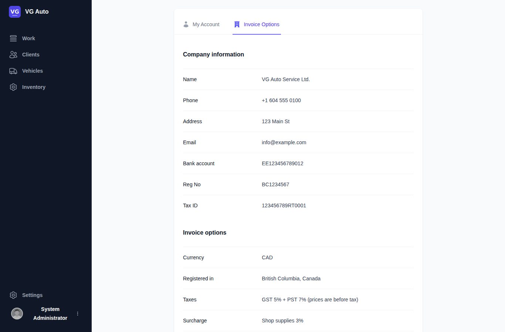

页面底部的 **Email delivery**（只有管理员能看到）用来检查公司的邮件是否配置正确：填一个邮箱，点 **Send test email**，系统会提示用哪种方式发送成功。公司用哪个邮箱发信在后台的 **发信设置** 里设置（见第 14 节）。

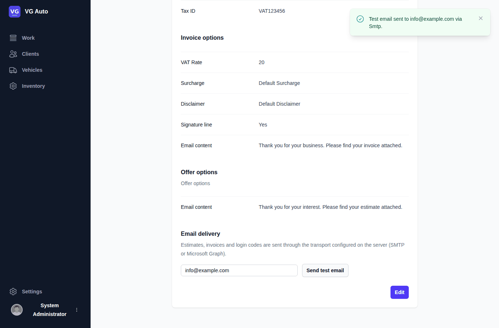

### 13. 个人资料

**Settings → My Account**（或点左下角的用户名）：修改姓名、邮箱、头像，修改密码，绑定或解绑 Microsoft 账号。

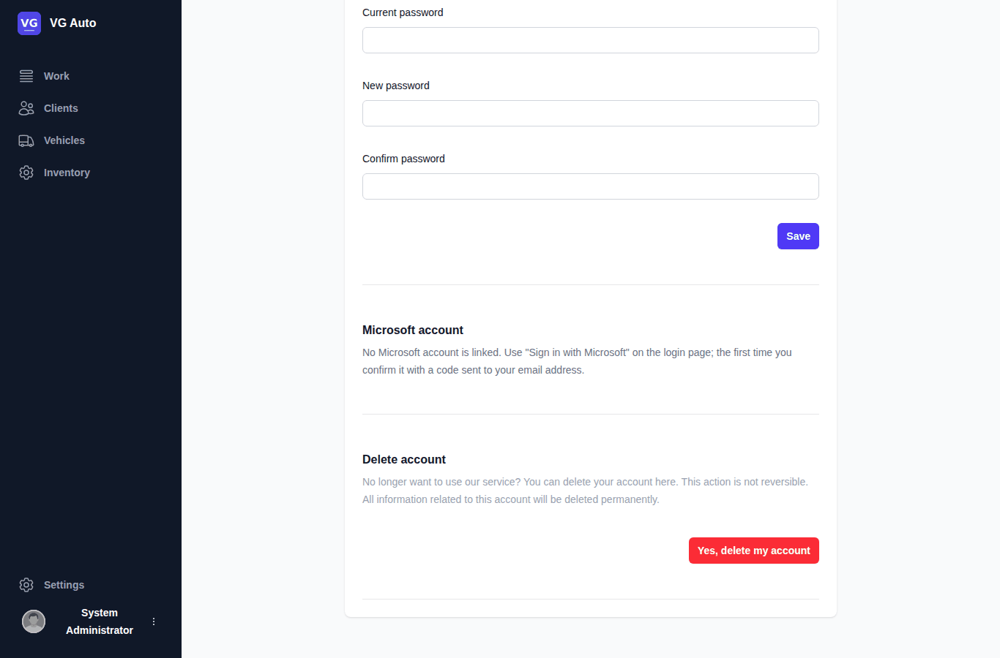

### 14. 管理后台（/admin）

管理员在 `https://你的域名/admin` 管理公司、员工和发信方式，也可以从左下角用户菜单里的 **Administration** 进入。后台左侧是菜单，左下角是当前账号、浅色/深色切换和中英文切换。

| 角色 | 能做什么 |
|---|---|
| 普通用户 | 使用系统（工单、客户、车辆、库存）；可以修改公司的联系信息、发票和报价单设置，但不能改公司名称、Reg No、Tax ID 和币种；进不了后台 |
| 管理员（公司管理员） | 管理**自己的公司**：公司信息（名称、地址、电话、Reg No、Tax ID、币种、税、发票和报价单设置）、公司的**发信设置**、本公司的员工（新建普通员工账号、修改资料、重置密码、解除锁定、禁用/启用、解绑 Microsoft 账号）和本公司的操作日志；删除没有工单在用的车辆；看不到其他公司 |
| 超级管理员 | 管理**所有公司和所有员工**：新建公司、修改任何公司的信息和发信设置、把员工调到其他公司、新建管理员和超级管理员、修改角色；设置**系统邮箱**并决定哪些公司可以使用它 |

**超级管理员的后台**：

- **总览**：公司数、员工数、登录账号、管理员和已禁用账号的数量，系统邮箱当前的发信方式，各公司的发信情况（使用系统邮箱 / 使用自己的邮箱 / 无法发信），以及最近的操作。
- **公司**：列出所有公司（Reg No、币种、员工数、登录账号数、发信方式）。新建公司时填写名称和币种，并可以勾选“允许使用系统邮箱”。
- **员工**：所有公司的员工，可以按公司筛选。
- **工单**：所有公司的工单（可按工单号、客户、车辆、发票或公司搜索，按公司筛选），列出报价单的发送和签名情况以及发票。打开工单可以看到它的报价单和发票（出具、发送、接受、签名、付款）并下载 PDF。**删除工单**会连同报价、维修任务、报价单（包括已发给客户或客户已签名的）和发票一起删除，无法恢复，并记入操作日志；如果删除的发票不是该公司最后一张，发票编号会缺一个号。车间里的普通删除规则不变（已发送的报价或发票不能删）。
- **系统邮箱**：系统自带的发信接口，发送登录验证码、重置密码邮件，以及被允许使用它的公司的报价单和发票。点选发信方式即可切换：
  - **服务器配置**：使用 `appsettings.Secrets.json` 或环境变量里的 `Email` 设置（和以前一样）；
  - **SMTP**：服务器、端口、加密方式、用户名、密码、发件地址和发件人名称；
  - **Microsoft 365**：通过 Microsoft Graph 发信，需要目录（租户）ID、应用程序（客户端）ID、客户端密码和发信邮箱（应用在 Microsoft Entra ID 注册，授予应用程序权限 `Mail.Send`）；
  - **Gmail**：Gmail 或 Google Workspace 地址和应用专用密码（Google 账号先开启两步验证，再在“安全性 → 应用专用密码”里创建）。

  保存后可以发送测试邮件。页面下方列出所有公司，用开关**允许或关闭**某个公司使用系统邮箱。多个租户共用一台服务器时，系统邮箱只能在服务器配置里设置。
- **操作日志**：所有公司的记录，可以按公司筛选。

**每个公司的页面**（超级管理员从 **公司** 进入，公司管理员从 **我的公司** 进入）有三个标签：

- **公司信息**：名称、Reg No、Tax ID、币种、电话、邮箱、地址、银行账户、税、发票和报价单设置。
- **发信设置**：公司的报价单和发票用哪个邮箱发出，可以选择公司自己的 **SMTP**、**Microsoft 365** 或 **Gmail** 邮箱，或者**系统邮箱**（需要超级管理员为该公司开放，未开放时显示“未开放”）。发件人名称为公司名称，客户回复会发到公司邮箱。超级管理员在这个页面上方也有“允许使用系统邮箱”的开关。保存后可以发送测试邮件。没有设置好发信方式的公司无法发送报价单和发票，页面上会提示。
- **员工**：该公司的员工，可以直接添加员工。

密码和客户端密码加密保存（密钥由 `JwtOptions:Secret` 派生），不会再显示；修改其他设置时留空即保持不变。**登录验证码始终由系统邮箱发送。**

账号管理：

- 初始账号 `admin` 是**所有者**（超级管理员）：只有本人能修改它，不能被禁用或降级。
- 任何人都不能在后台修改自己的角色和状态，自己的密码在个人资料里改。
- **添加员工**：填写姓名和邮箱，勾选“为这名员工创建登录账号”并填写用户名和角色。初始密码可以留空，系统会生成一个临时密码，**只显示一次**；用户首次登录时必须修改密码。登录验证码会发到填写的邮箱。公司管理员添加的员工属于自己的公司。
- 只负责维修、不需要登录的技师：不勾选创建登录账号即可（新建工单时从 **Mechanics** 旁的 **New** 添加也一样）。以后需要时可以在后台为他创建登录账号。
- **禁用账号**：员工离职时使用。禁用后立即退出、不能再登录，工单和历史记录都会保留。有登录账号的员工不能删除，只能禁用。
- **重置密码**：生成新的临时密码并解除锁定，用户下次登录时必须修改。
- **多个公司**（例如多家门店或分公司）共用一个数据库：
  - 每个公司有各自的客户、车辆、工单、库存、报价单和发票，以及各自的编号、设置、币种和发信方式。
  - 每个员工属于一个公司，登录后只能看到自己公司的数据。
  - 超级管理员在员工详情页的 **所属公司** 字段里调动员工，调动后他看到的是新公司的数据，已经做过的工单留在原公司。不能调动自己。
  - 员工详情页下方的 **公司信息** 可以直接修改该员工所属公司的信息；其他设置点 **该公司的全部设置**。
  - 升级前已有的数据全部归入第一个公司；升级时已有的公司都允许使用系统邮箱，行为和以前一样。
- **操作日志**：记录谁在什么时间新建账号、修改资料、重置密码、禁用/启用、修改角色、新建公司、修改公司设置、调动公司、修改系统邮箱或公司发信设置、开放或关闭系统邮箱和发送测试邮件。

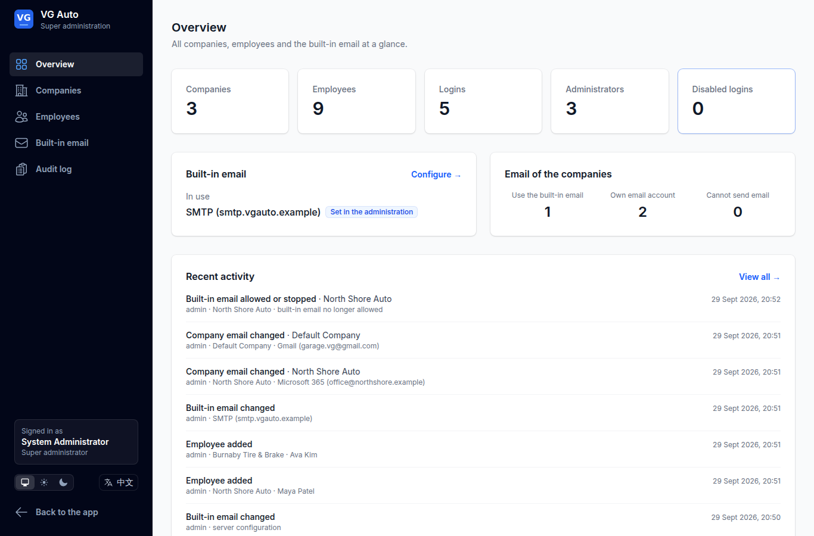

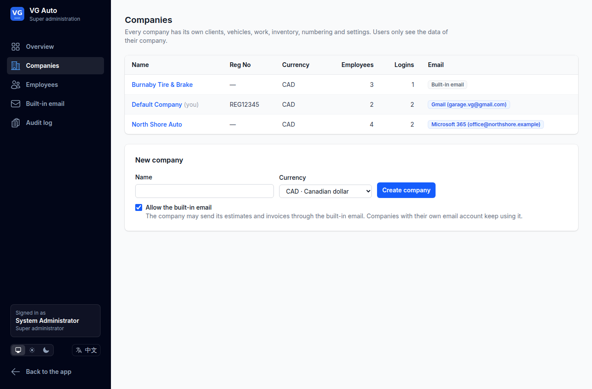

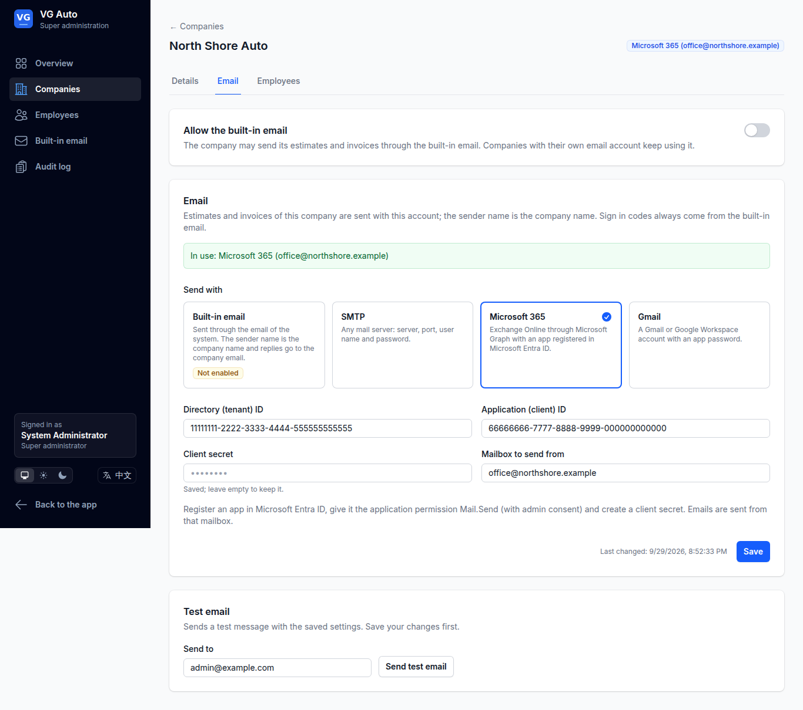

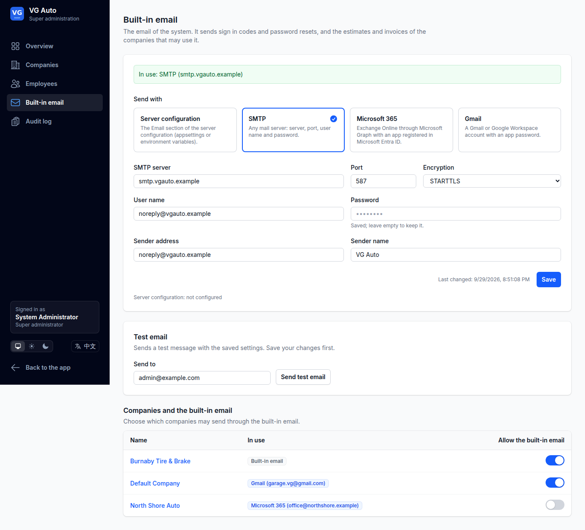

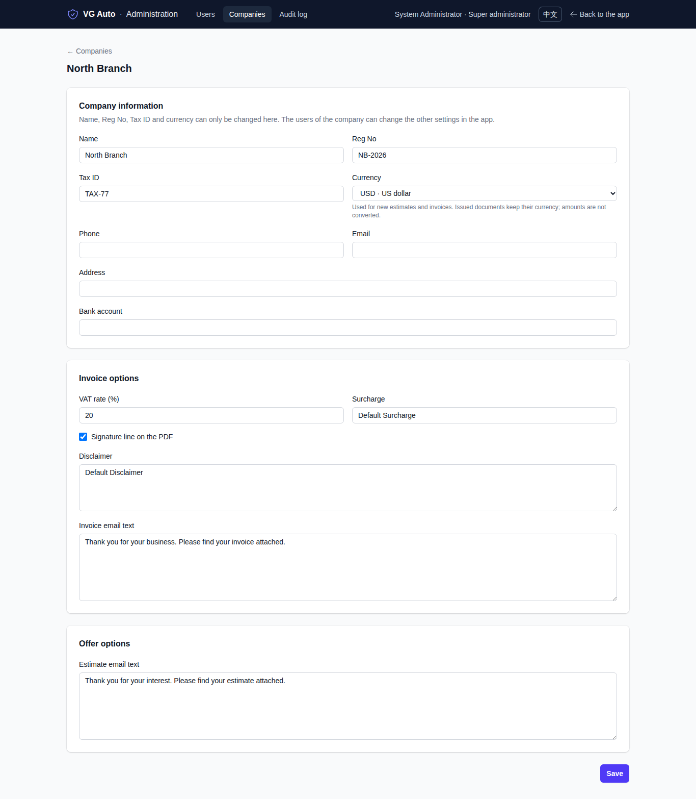

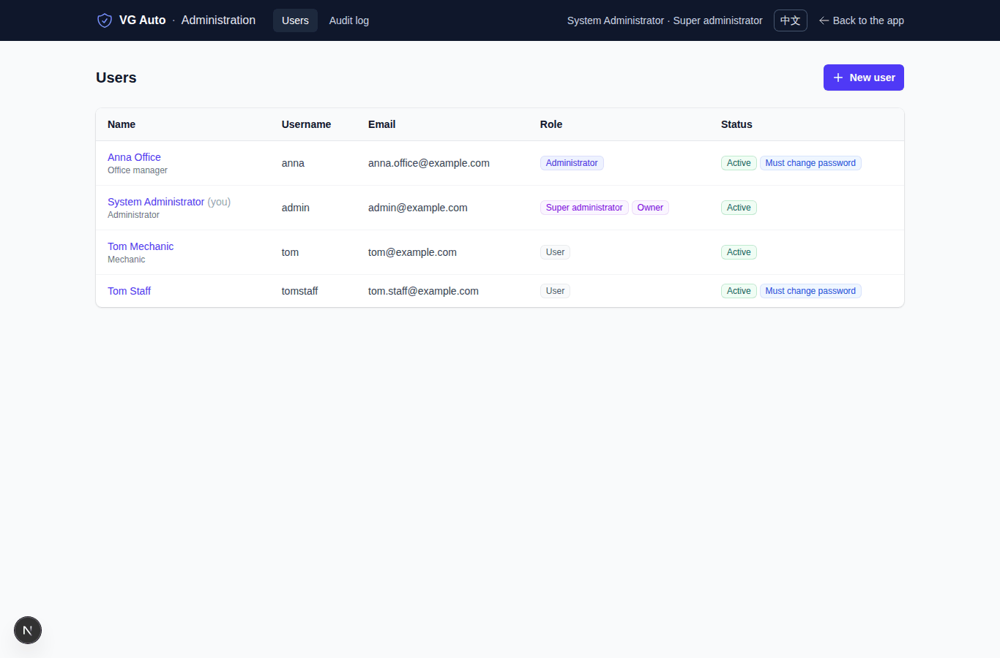

| 所有公司的工单 | 工单的单据和删除 |
|---|---|
| 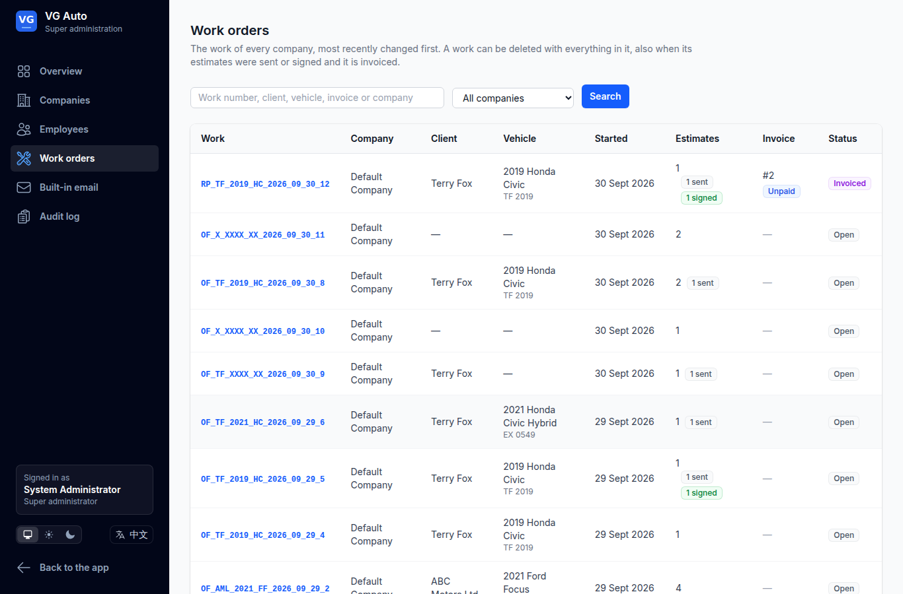 | 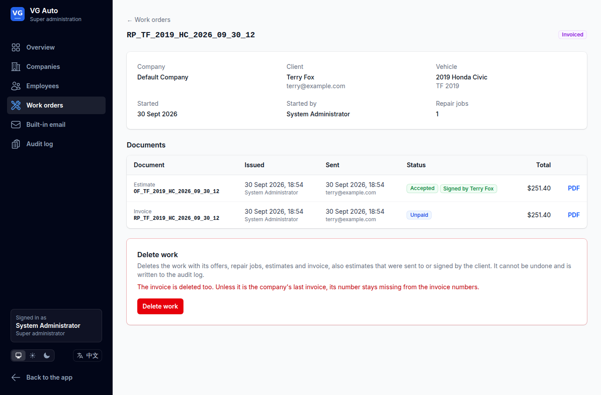 |

| 添加员工后显示临时密码 | 员工详情 |
|---|---|
| 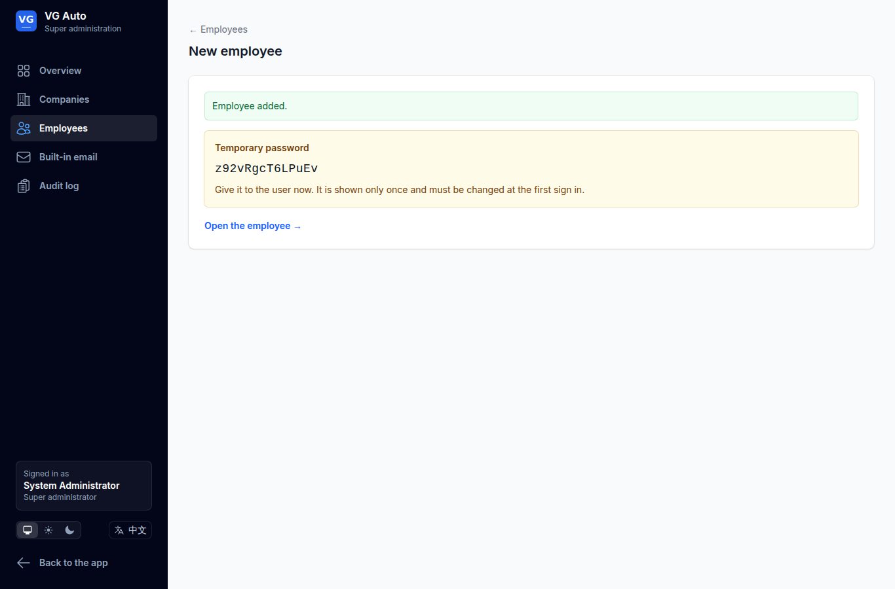 | 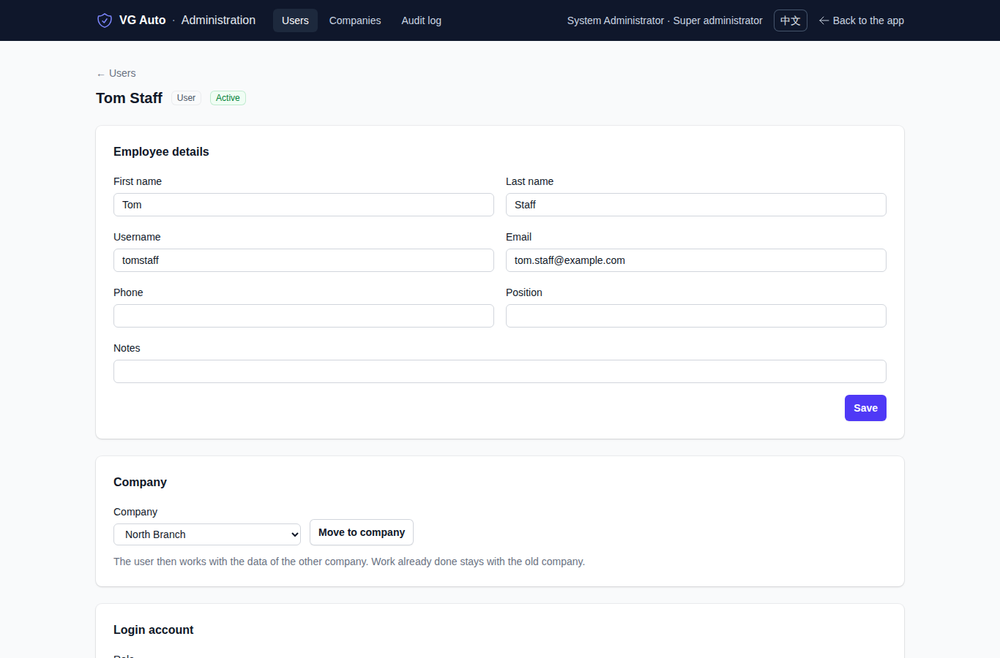 |

深色模式：

| 后台 | 系统 |
|---|---|
| 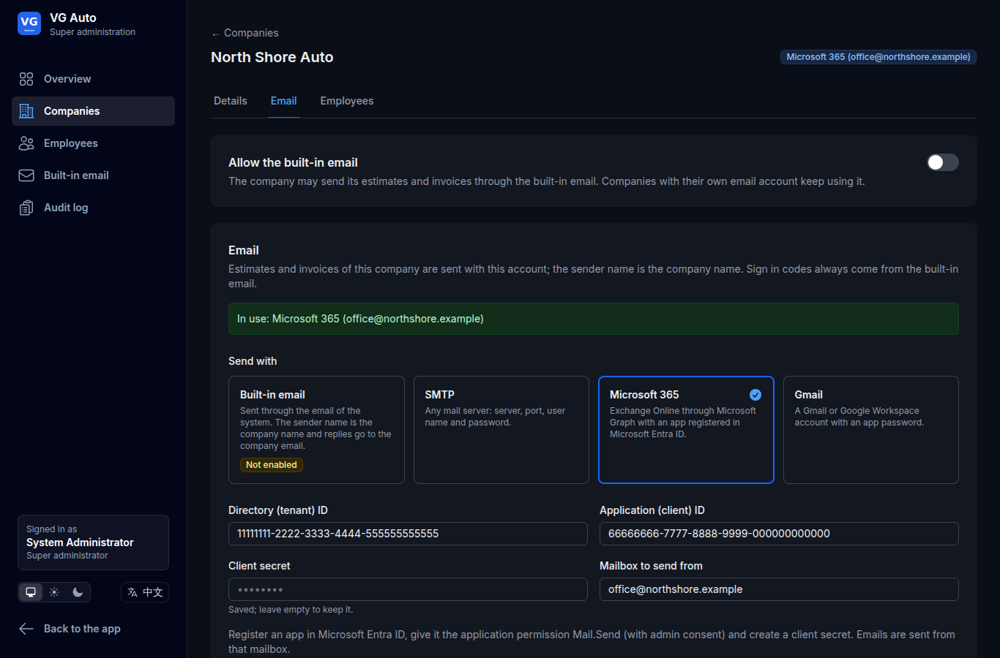 | 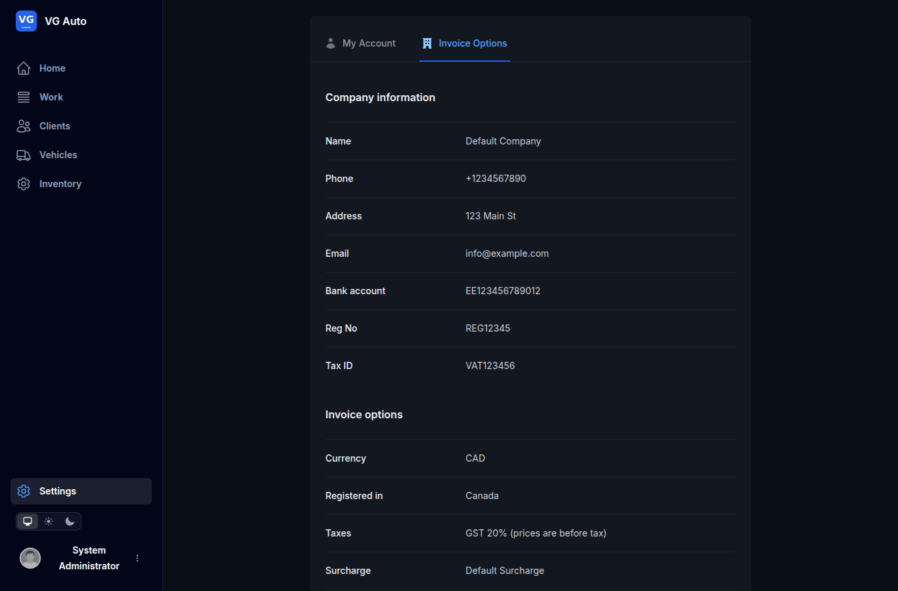 |

---

## 安装

支持 Linux（systemd + pm2 + nginx）、macOS 和 Windows，不需要 Docker。数据库可选 PostgreSQL 13+ 或 MySQL 8.0+。

### Debian 12 / Ubuntu 22.04+

```bash
git clone https://github.com/ecfranke/VG-Auto.git && cd VG-Auto
sudo deploy/prerequisites-debian.sh --db postgresql          # 或 --db mysql
sudo deploy/install.sh --app-url https://app.example.com --api-url https://api.example.com \
     --nginx --db-provider PostgreSql --admin-email you@example.com
# 第一次运行只生成 /etc/vg-auto 下的配置：创建数据库用户、填写邮件配置后，再运行一次
sudo deploy/create-database.sh /etc/vg-auto/appsettings.Secrets.json
sudo deploy/install.sh
sudo certbot --nginx -d app.example.com -d api.example.com
```

- 首次登录：用户名 `admin`，密码在 `/etc/vg-auto/initial-admin-password`。验证码会发到 `--admin-email` 指定的邮箱。
- 服务：API 是 systemd 服务 `vg-auto-api`，前端是 pm2 进程 `vg-auto-web`。

### 宝塔面板

数据库和反向代理在宝塔里配置，其余一条命令完成（不装 Nginx，不动数据库）：

```bash
sudo deploy/vgauto.sh baota --app-url https://app.example.com --api-url https://api.example.com \
     --db-provider MySql --db-host 127.0.0.1 --db-password '<宝塔里建库时的密码>' --admin-email you@example.com
```

完整步骤见 [部署指南 1.6 节](docs/deployment.zh-CN.md#16-使用宝塔面板部署ubuntu--debian)。

### 日常运维：`vgauto`

安装后可以在任何目录使用 `sudo vgauto`（macOS 不用 sudo）。不带参数运行会出现菜单。

| 命令 | 作用 |
|---|---|
| `sudo vgauto status` | 服务状态、健康检查、访问地址和版本 |
| `sudo vgauto start` / `stop` / `restart` | 启动 / 停止 / 重启 API 和前端 |
| `sudo vgauto logs api` / `logs web` | 实时日志 |
| `sudo vgauto upgrade` | 自动备份 → `git pull` → 重新安装 |
| `sudo vgauto backup [--keep 14]` | 数据库 + PDF + 配置打包备份 |
| `sudo vgauto restore <文件>` | 从备份恢复（需要确认，恢复前自动备份当前状态） |
| `sudo vgauto pdf-setup` | 安装生成 PDF 需要的系统库、中文字体和浏览器。下载或发送 PDF 失败时运行 |

### macOS

```bash
deploy/install.sh --app-url http://localhost:3000 --admin-email you@example.com
```

API 和前端都由 pm2 运行（`vg-auto-api`、`vg-auto-web`）。

### Windows

用管理员身份打开 PowerShell：

```powershell
deploy\windows\install.ps1 -AdminEmail you@example.com
```

API 注册为 Windows 服务 `VGAutoApi`，前端由 pm2 运行。

### 上线前必须完成的配置

1. **邮件**：登录验证码依赖邮件。在 `appsettings.Secrets.json` 的 `Email` 节配置 SMTP 或 Microsoft Graph，或者上线后由超级管理员在后台的 **系统邮箱** 里设置（SMTP、Microsoft 365 或 Gmail），然后发送测试邮件验证。各公司的发信方式在后台的公司页面设置。
2. **HTTPS**：生产环境必须启用 HTTPS（登录 Cookie 只在 HTTPS 下发送）。
3. **备份**：定期运行 `sudo vgauto backup --keep 14`（可以放进 crontab 或宝塔的计划任务），并把备份复制到别的机器。

SMTP 和 Microsoft Graph 的详细设置、Microsoft 登录的应用注册、安全配置和备份方法，见 **[部署与配置指南](docs/deployment.zh-CN.md)**。

---

## 开发者文档

### 架构

```
浏览器 ──► Next.js 前端（:3000）──服务端调用──► ASP.NET Core API（:15567）──► PostgreSQL / MySQL
             Server Actions                       │
             会话 Cookie（加密）                   ├─► SMTP / Microsoft Graph（邮件）
                                                  └─► Puppeteer / Chrome（PDF）
```

- 浏览器不直接持有高权限令牌。登录由 Next.js 服务端完成：它用 `SERVER_SECRET`（等于 API 的 `JwtOptions:ConsumerSecret`）调用 `/api/auth/*`，拿到两个 JWT：
  - `jwt`：服务端令牌，带 Root 角色，只保存在加密的会话 Cookie 中，用于 Server Actions 调用 API；
  - `publicJwt`：浏览器令牌，只能访问少数接口（如头像、延长会话）。
- API 默认所有接口都需要认证；业务接口额外要求 `ServerSidePolicy`（Root 角色）。
- 数据访问：写操作用 NHibernate（领域模型），查询和列表用 Dapper。`SqlDialect` 层负责 PostgreSQL 和 MySQL 的差异（表名映射、分页、JSON 等）。

### 目录结构

| 路径 | 说明 |
|---|---|
| `backend/src/VgAuto.Http.Api` | API：控制器、PDF 的 Razor 模板、启动配置 |
| `backend/src/VgAuto.Core.Application` | 业务服务：登录（`AuthService`）、邮件（`IEmailSender`）、查询、配置 |
| `backend/src/VgAuto.Core.Persistence` | 数据访问：NHibernate 映射、`IDbConnectionFactory`、`SqlDialect` |
| `backend/src/VgAuto.Domain` | 领域模型：工单、报价、维修任务、发票、客户、车辆、配件 |
| `backend/src/VgAuto.Http.Api.Model` | DTO 和映射 |
| `backend/src/DbUp` | 数据库迁移：`scripts`（PostgreSQL）、`scripts_mysql`（MySQL） |
| `backend/tests/VgAuto.Tests` | xUnit 单元测试和集成测试 |
| `frontend/src/app/auth` | 登录、验证码、找回密码、Microsoft 登录 |
| `frontend/src/app/home` | 业务页面：`work`、`clients`、`vehicles`、`inventory`、`settings`、`profile` |
| `deploy/` | 安装脚本，systemd / nginx 模板，`windows/install.ps1` |
| `scripts/` | `setup-secrets.sh` / `.ps1`：生成开发用密钥 |

### 本地运行

需要 .NET 9 SDK、Node.js 20+、PostgreSQL 或 MySQL 8，以及 Chrome/Chromium（生成 PDF 用）。

```bash
scripts/setup-secrets.sh             # 生成 appsettings.Secrets.json 和 frontend/.env，并打印数据库密码
# 用打印出的密码创建数据库用户（或者改 appsettings.Secrets.json 里的 DbOptions）
cd backend/src/DbUp && dotnet run                  # 建表，并打印一次初始管理员密码
cd ../VgAuto.Http.Api && dotnet run                # API：http://localhost:15567
cd ../../../frontend && npm ci && npm run dev      # 前端：http://localhost:3000
```

开发环境没有邮件服务器时，可以把 `Email:Smtp` 指向本地的 SMTP 测试工具（如 MailHog、smtp4dev），在那里查看验证码。

### 配置参考

API 配置在 `appsettings.json`，敏感信息放在 `appsettings.Secrets.json`（安装后位于 `/etc/vg-auto/`）。也可以用环境变量覆盖，例如 `DbOptions__Provider=MySql`。

| 配置项 | 说明 |
|---|---|
| `JwtOptions:Secret` | JWT 签名密钥（至少 64 字节随机值） |
| `JwtOptions:ConsumerSecret` | 前端服务端的密钥，必须和前端的 `SERVER_SECRET` 一致 |
| `JwtOptions:SessionTimeout` | 会话时长，默认 `08:00:00` |
| `DbOptions:Provider` | `PostgreSql` 或 `MySql` |
| `DbOptions:Host` / `Port` / `UserId` / `Password` / `Name` | 数据库连接 |
| `DbOptions:MultiTenancy:Enabled` | 多租户，仅 PostgreSQL 支持 |
| `DefaultAdmin:UserName` / `Email` / `Password` | 初始管理员，只在首次迁移时使用；密码留空则随机生成 |
| `Email:Provider` | `Smtp` 或 `Graph`；这一节是系统邮箱的“服务器配置”，超级管理员在后台选了其他方式后不再使用 |
| `App:Url` | 系统的访问地址（如 `https://shop.example.com`），用于报价邮件里的在线签名链接；不填时用 `Cors:AllowedOrigins` 的第一个地址 |
| `Signing:LinkDays` | 在线签名链接的有效天数，默认 30 |
| `Email:FromAddress` / `FromName` | 发件人 |
| `Email:Smtp:Host` / `Port` / `User` / `Password` / `Security` | SMTP；`Security` 为 `Auto`、`SslOnConnect`、`StartTls` 或 `None` |
| `Email:Graph:TenantId` / `ClientId` / `ClientSecret` / `Sender` | Microsoft Graph（应用权限 `Mail.Send`） |
| `Authentication:EmailCode` | 登录验证码：`RequireForPasswordLogin`、`CodeLifetimeMinutes`、`MaxAttempts`、`MaxSends`、`AllowUsersWithoutEmail` |
| `Authentication:PasswordReset:Enabled` | 是否允许找回密码 |
| `Authentication:Microsoft` | Microsoft 登录：`Enabled`、`ClientId`、`ClientSecret`、`TenantId` |
| `Cors:AllowedOrigins` | 允许跨域访问 API 的前端地址 |
| `Swagger:Enabled` | 是否开启 `/swagger`（生产环境建议关闭） |
| `Errors:IncludeDetails` | 错误响应中是否包含详细信息（仅用于调试） |
| `ForwardedHeaders:KnownProxies` | 反向代理的 IP，用于获取真实客户端 IP |
| `PdfDirectory` | PDF 保存目录 |
| `PuppeteerExecutablePath` | Chrome/Chromium 的路径。不填时依次使用：已下载到 `PuppeteerPath` 的 Chrome、系统里安装的 Chrome/Chromium/Edge，都没有才在线下载 |

前端配置在 `frontend/.env`（安装后位于 `/etc/vg-auto/web.env`）：

| 变量 | 说明 |
|---|---|
| `SERVER_SECRET` | 等于 API 的 `JwtOptions:ConsumerSecret` |
| `SESSION_SECRET` | 会话 Cookie 的加密密钥（32 字节随机值） |
| `API_URL` | 前端服务端访问 API 的地址（通常是内网地址） |
| `NEXT_PUBLIC_API_URL` | 浏览器访问 API 的地址 |
| `APP_URL` | 前端的对外地址（Microsoft 登录回调使用） |
| `COOKIE_SECURE` | 是否只在 HTTPS 下发送 Cookie；生产环境为 `true` |

### API 接口

开发模式下访问 `http://localhost:15567/swagger` 查看完整接口文档。主要分组：

| 路径 | 说明 |
|---|---|
| `POST /api/auth/login`、`verify`、`resend` | 密码登录 → 邮件验证码 → 获取令牌 |
| `POST /api/auth/password/forgot`、`password/reset` | 找回密码 |
| `GET /api/auth/providers`、`POST /api/auth/microsoft` | 登录方式、Microsoft 登录 |
| `/api/work/*`、`/api/pricings/*` | 工单、报价、维修任务、发票、PDF、发送邮件 |
| `/api/clients`、`/api/privateclients`、`/api/legalclients` | 客户 |
| `/api/vehicles`、`/api/spareparts`、`/api/storages` | 车辆（`DELETE /api/vehicles` 仅限管理员）、配件、库位 |
| `/api/employees` | 员工（技师）；创建登录账号需要管理员 |
| `/api/admin/*` | 管理后台：`me`、`overview`、`users`（新建、修改、`account`、`password`、`unlock`、`disable`、`enable`、`role`、`microsoft`、`company`）、`companies`（列表、新建、`{id}/options` 读取和修改、`{id}/email` 发信设置、`{id}/email/system` 开放系统邮箱、`{id}/email/test`）、`email/system`（系统邮箱、`test`）、`works`（超级管理员：所有工单、详情、`{id}/pdf/{documentId}`、删除）、`audit`（`companyId` 筛选） |
| `/api/public/estimates/{token}/view`、`sign`、`pdf` | 客户在线签名（无需登录，由 Next.js 服务器带服务器密钥调用） |
| `/api/options`（含 `testemail`） | 当前用户所属公司的设置、测试邮件 |
| `/api/profile`（含 `changepassword`、`externallogins`） | 个人资料、改密码、Microsoft 账号绑定 |
| `/api/query` | 列表查询 |
| `GET /health` | 健康检查（不需要认证） |

`/api/auth/*` 的请求都必须带 `serverSecret`，只能由前端服务端或管理员调用。

### 数据库迁移

迁移由 DbUp 执行，每次启动 `DbUp` 项目（安装脚本会自动运行）时按文件名顺序执行尚未执行过的脚本。新增迁移时，**两种数据库都要写**：

```
backend/src/DbUp/scripts/Script0006_描述.sql         # PostgreSQL
backend/src/DbUp/scripts_mysql/Script0006_描述.sql   # MySQL
```

- 编号必须递增，已经发布的脚本不要修改。
- PostgreSQL 使用 `domain.`、`tenant_config.` 等 schema；MySQL 没有 schema，对应表名分别是去掉前缀的表名和 `tenant_config_*`，`public.user` 对应 `app_user`。
- 在代码中写 SQL 时，通过 `SqlDialect` 处理表名和语法差异，不要直接写某一种数据库特有的语法。
- **公司隔离**：业务表都有 `company_id` 列。通过 NHibernate 的查询会自动加上当前公司的过滤条件（`CompanyFilter`），新记录自动写入当前公司；手写 SQL（Dapper、分页查询）必须自己加 `company_id` 条件（`PageResultQuery.ForCompany`、`this.CompanyId()`）。新增业务表时也要加 `company_id` 列并在映射里 `ApplyFilter<CompanyFilter>`。

### 测试

```bash
cd backend/tests/VgAuto.Tests
dotnet test                                                    # 单元测试
VGAUTO_TEST_DB_HOST=localhost VGAUTO_TEST_DB_USER=... VGAUTO_TEST_DB_PASSWORD=... dotnet test   # 加上 PostgreSQL 集成测试
VGAUTO_TEST_DB_PROVIDER=MySql VGAUTO_TEST_DB_HOST=localhost ... dotnet test                    # 针对 MySQL
cd ../../../frontend && npm run build                          # 前端构建（包含 lint 和类型检查）
```

集成测试会创建临时数据库，运行完整的迁移，并通过 `WebApplicationFactory` 测试登录流程和主要接口。

### CI

`.github/workflows/ci.yml` 在每次推送和 Pull Request 时运行：

- **Backend**：分别在 PostgreSQL 和 MySQL 上编译并运行全部测试，检查有漏洞的 NuGet 包；
- **Frontend**：`npm ci`、构建，并检查生产依赖中的严重漏洞。

### 已知限制

- 多租户只支持 PostgreSQL。
- MySQL 需要 8.0 及以上版本，不支持 MariaDB。
- 前端构建时需要能访问 Google Fonts。
- 界面目前只有英文。

---

## 许可证

Copyright © 2026 V. G. Global Solution Canada Inc. 保留所有权利。

本软件为专有软件，未经书面许可，不得复制、修改、分发或以其他方式使用，详见 [LICENSE](LICENSE)。项目使用的第三方开源组件及其许可证见 [THIRD-PARTY-NOTICES.md](THIRD-PARTY-NOTICES.md)。
